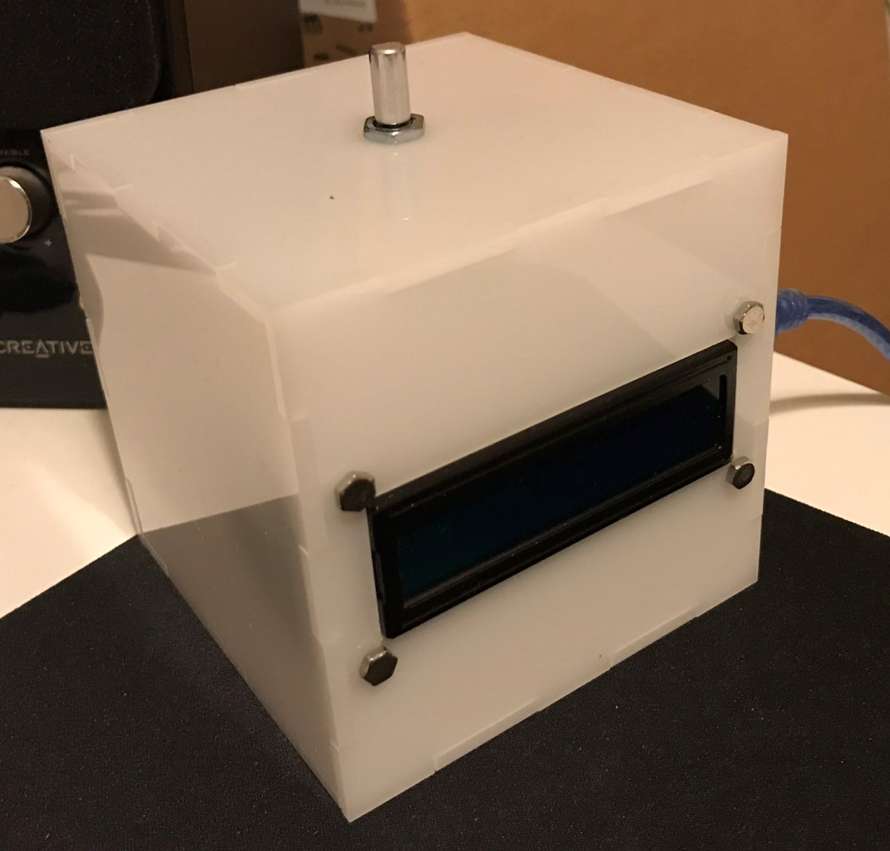
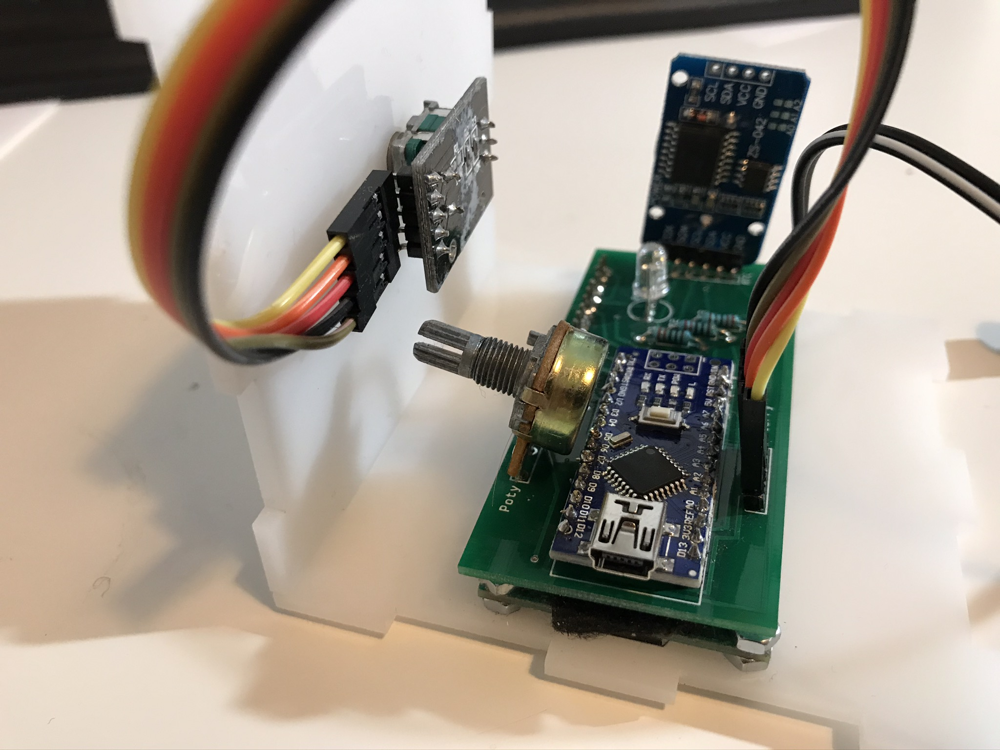
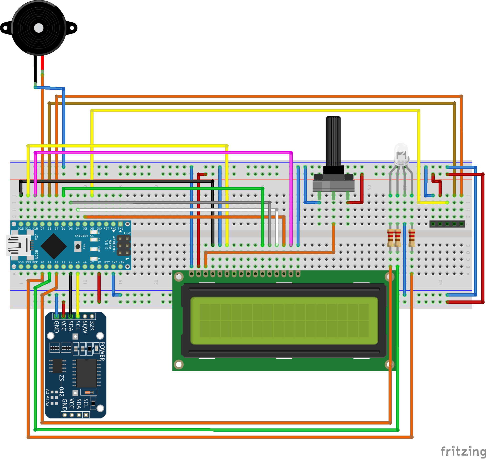

# LCD Clock

Simple arduino based LCD clock

## Housing

Housing created on [onshape](https://cad.onshape.com/documents/7e005409f38201798dc942d9/w/5e6d3c3bb7cc64c14bf61a7f/e/cab6b54d7c383a0fabe58725). just download laser cut. No glue needed.

## PCB

The layout was created using [fritzing](https://fritzing.org/home/). The layout can be found in the [pcb  directory](./pcb).

[Remove power led arduino nano](https://forum.arduino.cc/index.php?topic=418299.0)
[Remove power led RTC](https://oberguru.net/elektronik/rtc/ds3231/ds3231.html)